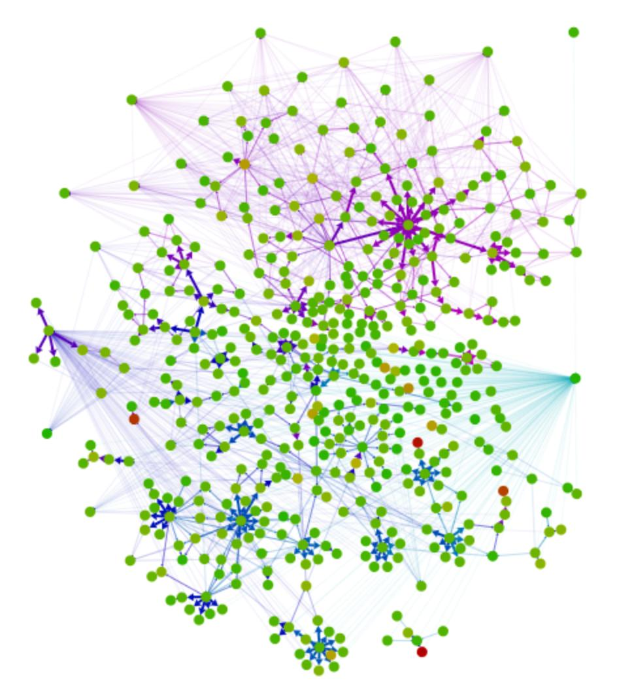

---

layout: default

---

# Яндекс

## **{{ site.presentation.title }}** {#cover}

    
{{ site.presentation.service }}





	
{{ site.author.name }},   {{ site.author.position }}

## CommonJS, AMD, ES6
{:.section}

### Введение в модули

## CommonJS

### Основа node.js

~~~ javascript
// sum.js
var lodash = require('lodash');

module.exports = function(arr) {
    return lodash.reduce(arr, function(memo, value) {
        return memo + value;
    });
}

// index.js
var sum = require('./sum.js');
console.log(sum([1, 2, 3]));
~~~

## CommonJS

* Плюсы
    * Поддерживается node.js из коробки
    * Синхронный
    * Простой

* Минусы
    * Не поддерживается браузерами
    * Синхронный

## AMD

### Async module definition

~~~ javascript
// sum.js
require(['lodash'], function(lodash) {
    return function(arr) {
        return lodash.reduce(arr, function(memo, value) {
            return memo + value;
        });
    };
});

// index.js
require(['./sum.js'], function(sum) {
    console.log(sum([1, 2, 3]));
});
~~~

## AMD

* Плюсы
    * Асинхронный
    * Простой

* Минусы
    * Не поддерживается браузерами
    * Не поддерживается node.js
    * Асинхронный

## ES6 modules

### Наше светлое будущее

~~~ javascript
// sum.js
import lodash from 'lodash';

export default function sum(arr) {
    return lodash.reduce(arr, function(memo, value) {
        return memo + value;
    });
}

// index.js
import sum from './sum.js';
console.log(sum([1, 2, 3]));
~~~

## ES6 modules

* Плюсы
    * Синхронный и асинхронный
    * Стандарт

* Минусы
    * Не поддерживается браузерами (пока)
    * Не поддерживается node.js (пока)
    * Новый синтаксис

## WebPack

{:.right-image}

* Поддержка CommonJS, AMD, ES6
* Синхронный и асинхронный из коробки
* Можно смешивать как угодно
* Кастомные загрузчики и плагины
* Оптимизация кода (webpack 2)

## WebPack

{:.center-image}

## WebPack configuration

~~~ javascript
// webpack.config.js
{
    context: __dirname + "/src",
    entry: './index.js',
    output: {
        path: __dirname + '/dist',
        filename: 'bundle.js'
    }
}
~~~

## WebPack. Two entry points

~~~ javascript
// webpack.config.js
{
    context: __dirname + "/src",
    entry: {
        app: './src/index.js',
        vendor: ['jquery', 'lodash']  
    },
    output: {
        path: __dirname + "/dist",
        filename: '[name].bundle.js',
        chunkFilename: '[id].bundle.js'
    }
}
~~~

## Webpack. Output

~~~ markup
Hash: b242e729504977ebd563
Version: webpack 1.13.0
Time: 753ms
           Asset    Size  Chunks             Chunk Names
   app.bundle.js  1.4 kB       0  [emitted]  app
vendor.bundle.js  788 kB       1  [emitted]  vendor
   [0] ./index.js 14 bytes {0} [built]
   [0] multi vendor 40 bytes {1} [built]
    + 3 hidden modules
~~~

## Webpack. AMD + CommonJS

~~~ javascript
var jquery = require('jquery');

require(['./sum.js'], function(sum) {
    jquery('body').text(sum([1, 2, 3]));
});
~~~

## Webpack. Output

~~~ markup
Hash: 95904f154d05f7c92a68
Version: webpack 1.13.0
Time: 773ms
           Asset    Size  Chunks             Chunk Names
   app.bundle.js  271 kB       0  [emitted]  app
     1.bundle.js  520 kB       1  [emitted]  
vendor.bundle.js  788 kB       2  [emitted]  vendor
   [0] ./index.js 127 bytes {0} [built]
   [0] multi vendor 40 bytes {2} [built]
   [2] ./sum.js 158 bytes {1} [built]
    + 3 hidden modules
~~~

## sum.js

~~~ javascript
var lodash = require('lodash');

module.exports = function(arr) {
    return lodash.reduce(arr, function(memo, value) {
        return memo + value;
    });
}
~~~

## WebPack. Two entry points

~~~ javascript
var webpack = require('webpack');
var CommonsChunkPlugin = webpack.optimize.CommonsChunkPlugin;

module.exports = {
    context: __dirname + '/src',
    entry: {
        app: './index.js',
        vendor: ['jquery', 'lodash']  
    },
    output: {
        path: __dirname + '/dist',
        filename: '[name].bundle.js',
        chunkFilename: '[id].bundle.js'
    },
    plugins: [
        new CommonsChunkPlugin('vendor', 'vendor.bundle.js')
    ]
};
~~~

## Webpack. Output

~~~ markup
Hash: 798885e8f502b6c6ccfc
Version: webpack 1.13.0
Time: 746ms
           Asset       Size  Chunks             Chunk Names
   app.bundle.js  390 bytes       0  [emitted]  app
     1.bundle.js  268 bytes       1  [emitted]  
vendor.bundle.js     791 kB       2  [emitted]  vendor
   [0] ./index.js 127 bytes {0} [built]
   [0] multi vendor 40 bytes {2} [built]
   [2] ./sum.js 158 bytes {1} [built]
    + 3 hidden modules
~~~

## Webpack. Compile output of app.bundle.js

~~~ javascript
webpackJsonp([0],[
/* 0 */
/***/ function(module, exports, __webpack_require__) {

    var jquery = __webpack_require__(1);

    // index.js
    __webpack_require__.e/* require */(1, function(__webpack_require__) { 
        var __WEBPACK_AMD_REQUIRE_ARRAY__ = [__webpack_require__(2)]; 
        (function(sum) {
            jquery('body').text(sum([1, 2, 3]));
        }.apply(null, __WEBPACK_AMD_REQUIRE_ARRAY__));
    });

/***/ }
]);
~~~

## Webpack. Compile output of 1.bundle.js

~~~ javascript
webpackJsonp([1],{

/***/ 2:
/***/ function(module, exports, __webpack_require__) {

    var lodash = __webpack_require__(3);

    module.exports = function(arr) {
        return lodash.reduce(arr, function(memo, value) {
            return memo + value;
        });
    }

/***/ }

});
~~~

## Webpack. Loaders

### Лоадеры позволяют подключать модули на любом языке

* ES6/ES7 - Babel
* CofeeScript
* TypeScript
* Handlebars
* Jade
* Stylus
* Less
* whatever

## Webpack. ES6

~~~ javascript
// index.js
import jquery from 'jquery';

require(['./sum.js'], (sum) => {
    jquery('body').text(sum([1, 2, 3]));
});

// sum.js
import lodash from 'lodash';

export default function(arr) {
    return lodash.reduce(arr, (memo, value) => memo + value);
}
~~~

## Webpack. Configure loaders

~~~ javascript
var webpack = require('webpack');

module.exports = {
    // ... ,
    module: {
        loaders: [
            { 
                test: /\.js$/, 
                loader: 'babel',
                exclude: /node_modules/
            }
        ]
    }
};
~~~

## Webpack. Compile output for 1.bundle.js

~~~ javascript
webpackJsonp([1],{

/***/ 2:
/***/ function(module, exports, __webpack_require__) {

    'use strict';

    Object.defineProperty(exports, "__esModule", {
        value: true
    });

    exports.default = function (arr) {
        return _lodash2.default.reduce(arr, function (memo, value) {
            return memo + value;
        });
    };

    var _lodash = __webpack_require__(3);

    var _lodash2 = _interopRequireDefault(_lodash);

    function _interopRequireDefault(obj) { return obj && obj.__esModule ? obj : { default: obj }; }

/***/ }

});
~~~

## Webpack loaders. Stylus

~~~ markup
// index.styl

.button
    width 40px
    height 40px
    background: url(plus.png)
~~~

## Webpack configuration

~~~ javascript
// ....,
entry: {
    app: './index.js',
    vendor: ['jquery', 'lodash'],
    style: './index.styl'
},
module: {
    loaders: [
        {
            test: /\.styl$/,
            loader: 'css!stylus'
        },
        {
            test: /\.png/,
            loader: 'file'
        }
    ]
}
~~~

## Webpack output

~~~ markup
Hash: a6a2de520f69b9ef0cd9
Version: webpack 1.13.0
Time: 5103ms
                               Asset       Size  Chunks             Chunk Names
884f0ab049bd23a0b3e15c5f2856064e.png    11.2 kB          [emitted]  
                       app.bundle.js  558 bytes       0  [emitted]  app
                         1.bundle.js  518 bytes       1  [emitted]  
                     style.bundle.js    2.12 kB       2  [emitted]  style
                    vendor.bundle.js     791 kB       3  [emitted]  vendor
   [0] multi vendor 40 bytes {3} [built]
    + 8 hidden modules
~~~

## Webpack compile output for style.bundle.js

~~~ javascript
webpackJsonp([2],[
/* 0 */
/***/ function(module, exports, __webpack_require__) {
    exports = module.exports = __webpack_require__(5)();
    // imports
    // module
    exports.push([module.id, ".button {\n  width: 40px;\n  height: 40px;\n  background: url(" + __webpack_require__(6) + ");\n}\n", ""]);
    // exports
/***/ },
/* 1 */,
/* 2 */,
/* 3 */,
/* 4 */,
/* 5 */
/***/ function(module, exports) {}])
~~~

## Usage

~~~ javascript
import styles from './styles.styl';

console.log(styles); // output css
~~~

## Webpack configuration

~~~ javascript
module.exports = { // ...,
    module: {
        loaders: [ // ...,
            {
                test: /\.styl$/,
                loader: 'style!css!stylus'
            }
        ]
    }
};
~~~

## Usage of style!css!stylus

~~~ javascript
// button.js

import './button.styl';

export class Button extends Backbone.View {
    // button code
}

// index.js

import {Button} from './button.js';

// use Button 
~~~

## Webpack extract styles

~~~ javascript
var webpack = require('webpack');
var ExtractTextPlugin = require('extract-text-webpack-plugin');

module.exports = { // ...,
    plugins: [ // ...,
        new ExtractTextPlugin("styles.css")
    ],
    module: {
        loaders: [ // ...,
            {
                test: /\.styl$/,
                loader: ExtractTextPlugin.extract('css!stylus')
            }
        ]
    }
};
~~~

## Webpack output

~~~ markup
Hash: e2829842e539dbaefb2e
Version: webpack 1.13.0
Time: 5058ms
                               Asset       Size  Chunks             Chunk Names
884f0ab049bd23a0b3e15c5f2856064e.png    11.2 kB          [emitted]  
                       app.bundle.js  558 bytes       0  [emitted]  app
                         1.bundle.js  518 bytes       1  [emitted]  
                     style.bundle.js  117 bytes       2  [emitted]  style
                    vendor.bundle.js     791 kB       3  [emitted]  vendor
                          styles.css  100 bytes       2  [emitted]  style
   [0] multi vendor 40 bytes {3} [built]
    + 8 hidden modules
Child extract-text-webpack-plugin:
        + 3 hidden modules
~~~

## Webpack compile output for styles.css

~~~ css
.button {
  width: 40px;
  height: 40px;
  background: url(884f0ab049bd23a0b3e15c5f2856064e.png);
}
~~~

## Visualization

{:.center-image}

## **Контакты** {#contacts}

{{ site.author.name }}

{{ site.author.position }}

